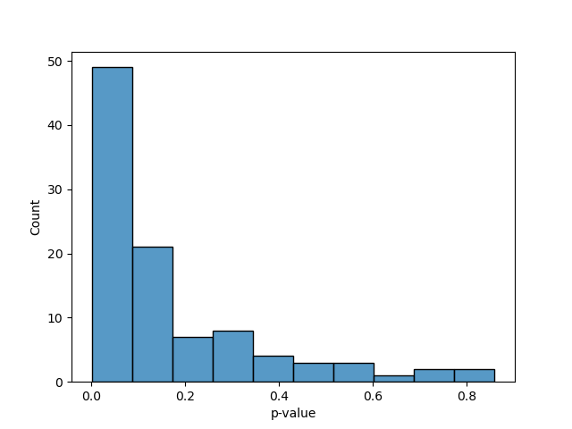

[](https://github.com/gibsramen/qupid/actions)
[](https://pypi.org/project/qupid)

# qupid

(Pronounced like cupid)

qupid is a tool for generating and statistically evaluating *multiple* case-control matchings of microbiome data.

## Installation

You can install the most up-to-date version of qupid from PyPi using the following command:

```
pip install qupid
```

## Tutorial

There are three primary steps to the qupid workflow:

1. Match each case to all valid controls
2. Generate multiple one-to-one matchings
3. Evaluate the statistical differences between cases and controls for all matchings

To match each case to all valid controls, we need to first establish matching criteria.
qupid allows matching by both categorical metadata (exact matches) and continuous metadata (matching within provided tolerance).
You can match on either a single metadata column or based on multiple.

In qupid, the cases to be matched are referred to as the "focus" set, while the set of all possible controls is called the "background".
For this tutorial we will be used data from the American Gut Project to match cases to controls in samples from people with autism.

First, we'll load in the provided example metadata and separate it into the focus (samples from people with autism) and the background (samples from people who do not have autism).

### Loading data

```python
from pkg_resources import resource_filename
import pandas as pd

metadata_fpath = resource_filename("qupid", "tests/data/asd.tsv")
metadata = pd.read_table(metadata_fpath, sep="\t", index_col=0)

# Designate focus samples
asd_str = "Diagnosed by a medical professional (doctor, physician assistant)"
no_asd_str = "I do not have this condition"

background = metadata.query("asd == @no_asd_str")
focus = metadata.query("asd == @asd_str")
```

### Matching each case to all possible controls

Next, we want to perform case-control matching on sex and age.
Sex is a discrete factor, so qupid will attempt to find exact matches (e.g. male to male, female to female).
However, age is a continuous factor; as a result, we should provide a tolerance value (e.g. match within 10 years).
We use the `match_by_multiple` function to match based on more than one metadata category.

```python
from qupid import match_by_multiple

cm = match_by_multiple(
    focus=focus,
    background=background,
    category_type_map={"sex": "discrete", "age_years": "continuous"},
    tolerance_map={"age_years": 10}
)
```

This creates a `CaseMatchOneToMany` object where each case is matched to each possible control.
You can view the underlying matches as a dictionary with `cm.case_control_map`.

### Generating mappings from each case to a single control

What we now want is to match each case to a *single* control so we can perform downstream analysis.
However, we have *a lot* of possible controls.
We can easily see how many cases and possible controls we have.

```python
print(len(cm.cases), len(cm.controls))
```

This tells us that we have 45 cases and 1785 possible controls.
Because of this, there are many possible sets of valid matchings of each case to a single control.
We can use qupid to generate many such cases.

```python
results = cm.create_matched_pairs(iterations=100)
```

This creates a `CaseMatchCollection` data structure that contains 100 `CaseMatchOneToOne` instances.
Each `CaseMatchOneToOne` entry maps each case to *a single control* rather than all possible controls.
We can verify that each entry has exactly 45 cases and 45 controls.

```python
print(len(results[0].cases), len(results[0].controls))
```

qupid provides a convenience method to convert a `CaseMatchCollection` object into a pandas DataFrame.
The DataFrame index corresponds to the cases, while each column represents a distinct set of matching controls.
The value in a cell represents a matching control to the row's case.

```python
results_df = results.to_dataframe()
results_df.head()
```

```
                                0                 1   ...                98                99
case_id                                               ...
S10317.000026181  S10317.000033804  S10317.000069086  ...  S10317.000108605  S10317.000076381
S10317.000071491  S10317.000155409  S10317.000103912  ...  S10317.000099277  S10317.000036401
S10317.000029293  S10317.000069676  S10317.X00175749  ...  S10317.000069299  S10317.000066846
S10317.000067638  S10317.X00179103  S10317.000052409  ...  S10317.000067511  S10317.000067601
S10317.000067637  S10317.000067747  S10317.000098161  ...  S10317.000017116  S10317.000067997

[5 rows x 100 columns]
```

### Statistical assessment of matchings

Once we have this list of matchings, we want to determine how statistically difference cases are from controls based on some values.
qupid supports two types of statistical tests: univariate and multivariate.
Univariate data is in the form of a vector where each case and control has a single value.
This can be alpha diversity, log-ratios, etc.
Multivariate data is in the form of a distance matrix where each entry is the pairwise distance between two samples, e.g. from beta diversity analysis.
We will generate random data for this tutorial where there exists a small difference between ASD samples and non-ASD samples.

```python
import numpy as np

rng = np.random.default_rng()
asd_mean = 4
ctrl_mean = 3.75

num_cases = len(cm.cases)
num_ctrls = len(cm.controls)

asd_values = rng.normal(asd_mean, 1, size=num_cases)
ctrl_values = rng.normal(ctrl_mean, 1, size=num_ctrls)

asd_values = pd.Series(asd_values, index=focus.index)
ctrl_values = pd.Series(ctrl_values, index=background.index)

sample_values = pd.concat([asd_values, ctrl_values])
```

We can now evaluate a t-test between case values and control values for each possible case-control matching in our collection.

```python
from qupid.stats import bulk_univariate_test

test_results = bulk_univariate_test(
    casematches=results,
    values=sample_values,
    test="t"
)
```

This returns a DataFrame of test results sorted by descending test statistic.

```
   method_name test_statistic_name  test_statistic   p-value  sample_size  number_of_groups
15      t-test                   t        3.900874  0.000187           90                 2
61      t-test                   t        3.770914  0.000294           90                 2
50      t-test                   t        3.536803  0.000649           90                 2
32      t-test                   t        3.395298  0.001030           90                 2
68      t-test                   t        3.310822  0.001350           90                 2
..         ...                 ...             ...       ...          ...               ...
13      t-test                   t        0.645694  0.520158           90                 2
49      t-test                   t        0.555063  0.580260           90                 2
92      t-test                   t        0.409252  0.683349           90                 2
51      t-test                   t        0.110707  0.912101           90                 2
34      t-test                   t        0.048571  0.961371           90                 2

[100 rows x 6 columns]
```

From this table, we can see that iteration 15 best separates cases from controls based on our random data.
Conversely, iteration 34 showed essentially no difference between cases and controls.
This shows that it is important to create multiple matchings as some of them are better than others.
We can plot the distribution of p-values to get a sense of the overall distribution.

```python
import matplotlib.pyplot as plt
import seaborn as sns

sns.histplot(test_results["p-value"])
```



We see that most of the p-values are near zero which makes sense because we simulated our data with a difference between ASD and non-ASD samples.

### Saving and loading qupid results

qupid allows the saving and loading of both `CaseMatch` and `CaseMatchCollection` objects.
`CaseMatchOneToMany` and `CaseMatchOneToOne` objects are saved as JSON files while `CaseMatchCollection` objects are saved as pandas DataFrames.

```python
from qupid.casematch import CaseMatchOneToMany, CaseMatchOneToOne, CaseMatchCollection

cm.save("asd_matches.one_to_many.json")  # Save all possible matches
results.save("asd_matches.100.tsv")  # Save all 100 iterations
results[15].save("asd_matches.best.json")  # Save best matching

CaseMatchOneToMany.load("asd_matches.one_to_many.json")
CaseMatchCollection.load("asd_matches.100.tsv")
CaseMatchOneToOne.load("asd_matches.best.json")
```

## Help with qupid

If you encounter a bug in qupid, please post a GitHub issue and we will get to it as soon as we can. We welcome any ideas or documentation updates/fixes so please submit an issue and/or a pull request if you have thoughts on making qupid better.
